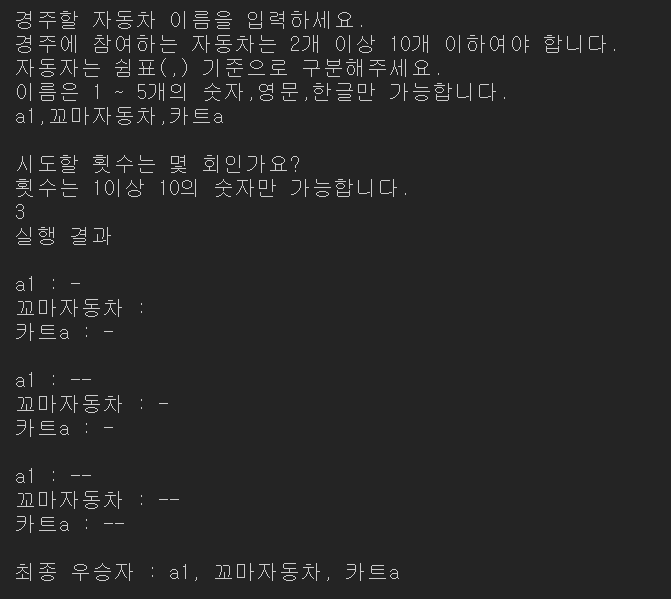
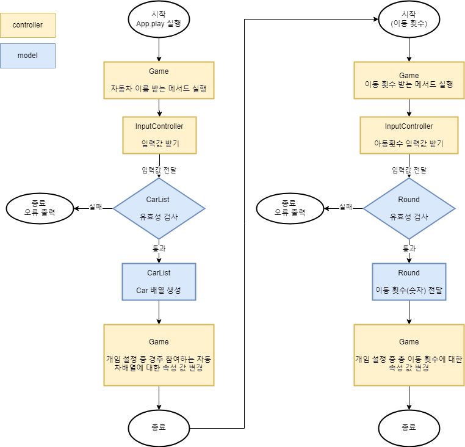
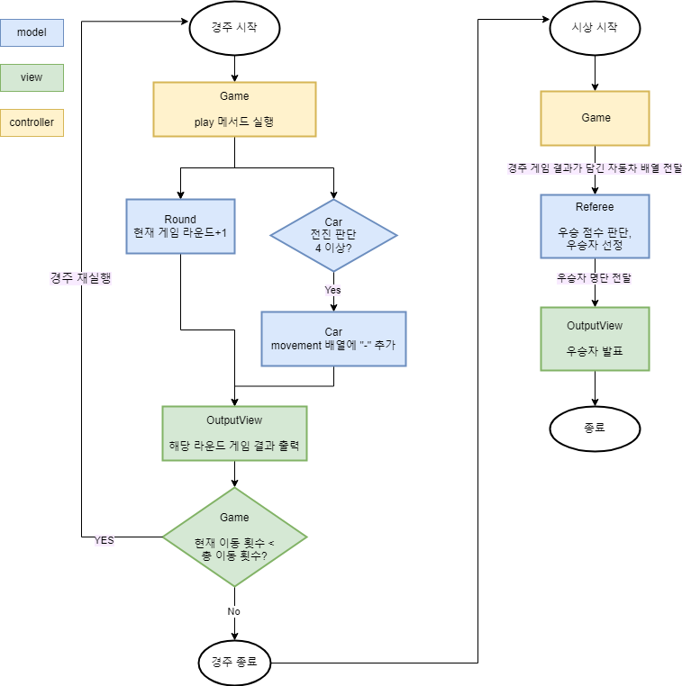

# 우테코 6추차 미션: 자동차 경주 🏎️ 🏁

[🫙우테코 6주차 미션 저장소 가기](https://github.com/woowacourse-precourse/javascript-racingcar-6)

## 설치 및 테스트

Install

```
npm i
```

Test

```
npm run test
```

## 구현

### 기능 구현 목록

[기능구현 목록 보러가기](https://github.com/BadaHertz52/javascript-racingcar-6/blob/badahertz52/docs/README.md#%EC%9E%90%EB%8F%99%EC%B0%A8-%EA%B2%BD%EC%A3%BC)

### 구현 모습



### MVC 디자인 패턴 적용

| mvc        | 폴더             | 역할                                                                                       |
| ---------- | ---------------- | ------------------------------------------------------------------------------------------ |
| model      | models폴더       | 경주에 참여하는 자동차,이동횟수,우승자에 대한 데이터 관리                                  |
| view       | view 폴더        | 입력과 출력 메세지 담당                                                                    |
| controller | controllers 폴더 | 입력값을 데이터(자동차,이동횟수)로 넘겨주고, 게임 실행, 출력해야 할 데이터를 view에 넘겨줌 |

<details>
<summary> 🗂️ 파일 구조 보기</summary>
<div markdown="1">

```
📦src
 ┣ 📂constants
 ┃ ┣ 📜index.js
 ┃ ┣ 📜Message.js :입력,출력 메세지 관리
 ┃ ┣ 📜Regex.js  : 정규표현식 관리
 ┃ ┗ 📜Rule.js   : 게임 룰에 관한 변수 관리
 ┣ 📂controllers
 ┃ ┣ 📜Game.js  : 게임에 대한 전반적인 것들을 관리 (입력값을 받아서 게임 실행 환경 설정, 게임 실행,결과 출력)
 ┃ ┣ 📜index.js
 ┃ ┗ 📜InputController.js : 자동차 이름, 이동 횟수에 대한 입력값을 받아서 모델에 전달
 ┣ 📂models
 ┃ ┣ 📜Car.js : 경주에 참여하는 자동차 이름,전진 횟수에 대한 데이터 관리
 ┃ ┣ 📜CarList.js : 입력값을 받아서 유효성 검사를 진행 후 경주에 참여하는 자동차 배열을 생성
 ┃ ┣ 📜index.js
 ┃ ┣ 📜Referee.js : 경주 결과에 따라 우승자 판단
 ┃ ┗ 📜Round.js : 입력값을 받아 유효성 검사를 진행 및 이동 횟수에 대한 데이터 관리
 ┣ 📂utils
 ┃ ┣ 📜Error.js : 오류를 출력하는 유틸 함수 관리
 ┃ ┗ 📜index.js
 ┣ 📂view
 ┃ ┣ 📜index.js
 ┃ ┣ 📜InputView.js : 입력창 담당
 ┃ ┗ 📜OutputView.js :  메세지 출력 담당
 ┣ 📜App.js
 ┗ 📜index.js
```

</div>
</details>

### 순서도

<details>
<summary>📜자동차 이름, 이동 횟수 입력 및 설정에 대한 순서도</summary>

</details>
<br/>
<details>
<summary>📜 경주 실행 및 우승자 출력에 대한 순서도</summary>

</details>

## 공부

### 의미 있는 커밋 메세지

이번 1주차 공통 피브백에 "의미 있는 커밋 메세지를 적자"라는 것이 있어서 이번 기회에 어떤 커밋 메세지가 좋은 것인지 공부하고 이를 정리해봤습니다.

#### 커밋 메세지 규칙

- 제목과 본문을 빈행을 구분한다
- 제목은 50글자 이내로 작성한다.
- 제목의 첫글자는 대문자로 작성한다.
- 제목 끝에는 마침표를 넣지 않는다.
- 제목은 현재형, 명령문으로 작성한다.
- 본문의 각행은 72글자 내로 한다.
- 무엇을 왜에 중점을 두어 작성한다.

#### 커밋 메세지 구조

```
type(scope): header(short summary)
<BLANK LINE>
body
<BLANK LINE>
footer
```

#### Type : 해당 커밋의 성격

- feat: 새로운 기능
- fix : 버그 수정
- docs: 문서 수정
- test: 테스트 코드 수정
- refactor: 코드 리팩토링
- build: 빌드 관련 파일 수정, 모듈 설치 또는 삭제에 대한 커밋
- style : 코드 스타일(ex: css 파일 변경) ,포맷에 대한 수정
- perf: 성능 개선
- ci : CI 관련 설정 수정
- chore : 그 외 수정

#### Score

스코프는 해당 커밋이 어떤 부분에서 변경이 일어났는 지를 나타내는 것으로 변경된 파일, 함수 ,클래스등을 적으면 되고 생략 가능합니다.

```
feat(login): Add new feature to login page
```

#### Header

해당 커밋에 대한 짧은 요약문으로 대문자로 시작해 현재형, 명령문으로 작성하고 마침표를 찍지 않습니다.

#### Body

본문은 Header에서 간랸하게 표현한 변경 사항들을 보다 자세하게 풀어 넣으면 되며 변경 이유와 변경 전과의 차이점이 들어나도록 하고 현재,명령문으로 작성해야 합니다.

#### Footer

하단에는 주요 변경 내역들과 해결된 이슈들을 적는다.
주요 변경 내역에는 변경점, 변경 사유, 마이스레이젼 지시가 언급되어야 하고 해결된 이슈는 Close #<이슈번호> 의 형식으로 적어줍니다.

#### 🤔고민해볼 것 : 커밋 메세지를 영어로 작성해야할까?

이제까지 프로젝트를 진행하면서 커밋 메세지를 영어로 작성해왔습니다. 영어가 편하기보다는 개발 공부를 시작하고 커밋 메세지 작성법을 찾아볼때의 예시와 기준이 영어였고 아무래도 영어가 개발 시의 기준(?)언어이다 보니 영어로 작성하는 법을 알아야 한다고 생각합니다.
그러나 영어를 익숙하게 사용하지 않기 때문에 커밋 메세지를 작성하는게 한계가 있을 수 밖에 없었다. 번역기를 사용한다 해도 자연스럽지 않을 때가 있었다. 팀 프로젝트나 이번 우테코의 지원자분들의 커밋 메세지를 보면 한글로 작성하시는 분들이 있어서 칮아보니 꼭 영어로 작성하지 않아도 되지 않을까 합니다.

### 개발 시 사용되는 Eslint,Prettier 패키지를 git에 올리지 않는 방법

우테코의 자바스크립트 스타일 가이드는 Airbnb 자바스크립트 스타일 가이드를 기준으로 하기 때문에 이와 관련된 Eslint, Prettier 패키지를 설치하고 설정 파일을 만들어서 사용했습니다.

문제는 package.json을 변경하지 않는다는 프로그래밍 요구사항이 존재하는데 package.json이 이미 git에 올려져 있어서 .gitignore 에 package.json을 추가해도 git에 적용대상이 됩니다.

참여자 한분이 디스코드에 이를 해결하는 [방법](https://velog.io/@largopie/git-%ED%8A%B9%EC%A0%95-%ED%8C%8C%EC%9D%BC-%EC%9E%84%EC%8B%9C%EC%A0%81%EC%9C%BC%EB%A1%9C-%EC%BB%A4%EB%B0%8B%EC%97%90-%EC%A0%9C%EC%99%B8%ED%95%98%EA%B8%B0)을 공유해주셔서, 이를 통해 문제를 해결했고 방법은 `--assume-unchanged` 라는 git 옵션을 사용하는 것입니다.

```bash
 $ git update-index --assume-unchanged <파일이름>
```

위의 git 명령어를 통해 git에서 추적 중인 파일 중 일부 파일을 임시로 수정하지 않은 것을 가정해 해당 파일이 수정되어도 커밋에서 제외됩니다.

```bash
$ git update-index --no-assume-unchanged <파일이름>
```

`--no-assume-unchanged` 옵션을 사용하면 다시 git의 추적 대상이 됩니다.

Eslint와 Prettier 를 적용하기 위해 vscode의 setting.json 파일도 생성했기 때문에 gitignore에 커밋에서 제외할 파일들을 추가한 후 gitignore 파일 자체를 `--assume-unchanged`옵션으로 git의 추적을 임시적으로 중단하는 방식을 선택했습니다.

### 객체 지향 프로그래밍 구현

1주차 공통 피드백에 첨부된 학습 자료 중 "숫자 야구 피드백 강의"에서 객체 지향 프로그래밍을 다음의 방식으로 구현했습니니다.

1. 구현할 기능들을 작성 후,기능들을 특성별로 묶는다.(추상화)
2. 1에서 특성별로 묶을 것을 클래스로 만든다.
3. 2에서 만들 클래스를 인스턴스화한다.
4. 해당 클래스가 니다.

개발 시에는 비즈니스 로직을 담당하는 파일들을 담는 service 폴더와 비즈니스 객체이 담긴 domain 폴더로 관리되는 것 같습니다.

---

#### 자료 출처

[[10분 테코톡] 🧀 제리의 MVC 패턴](https://youtu.be/ogaXW6KPc8I?si=GMU4ZPVGRtPZhn0h)
[5Layer](https://sac4686.tistory.com/15)
