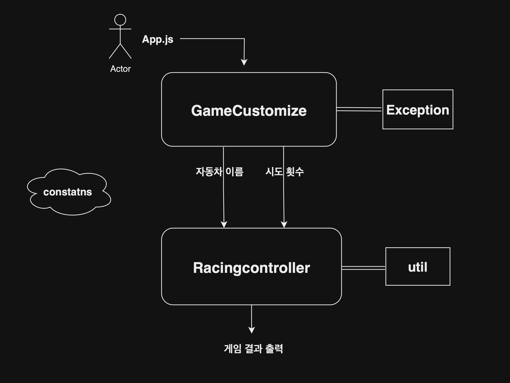

# Big Sketch
 

 
 

# Small Sketch
 

📦src                
 ┣ 📂constants             
 ┃ ┣ 📜Constants.js - 게임 규칙에 종속된 수치 상수처리                     
 ┃ ┗ 📜Messeage.js - 게임 메세지 상수처리                   
 ┣ 📂exception                  
 ┃ ┣ 📜Commas.js - 쉼표의 오용 검증      
 ┃ ┣ 📜Exception.js  - 자동차 이름, 게임 시도 횟수 검증                     
 ┃ ┣ 📜OverName.js - 5글자 초과 검증                    
 ┃ ┣ 📜SameName.js - 중복 이름 검증                    
 ┃ ┗ 📜SingleName.js - 싱글 플레이어 검증                       
 ┣ 📂racing                 
 ┃ ┣ 📜GameCustomize.js - 사용자 정보를 입력받아 검증 후 내보내기    
 ┃ ┗ 📜RacingController.js - 사용자 입력 정보를 이용해 게임 결과 계산 및 출력                  
 ┣ 📂util                 
 ┃ ┣ 📜Accumulator.js - 자동차 이동거리 누적기, 게임 점수 누적기                  
 ┃ ┣ 📜Converter.js - 컴퓨터가 생성한 숫자를 게임 규칙에 맞게 가공하여 변환해주는 필터역할                     
 ┃ ┣ 📜FindWinner.js - 최종 이동거리 정보를 기반으로 우승자를 추출해 나열      
 ┃ ┗ 📜RandomArrayGenerator.js - 원하는 길이의 0~9로 이루워진 랜덤 배열 생성            
 ┣ 📜App.js - RacingController를 이용해 게임 시작                    
 ┗ 📜index.js - playground                

 
 

# 예외 처리 및 피드백
        

- 사용자에게 입력받은 자동차 이름과 시도 횟수에 대한 유효성 검증이 이루워진다.         
- 에러 메세지는 여섯 종류가 있으며 에러 발생시 여섯 가지중 하나의 에러 메세지가 전달된다.
- 자동차 이름 입력시, 여러 예외 상황이 동시에 겹쳤을 경우 가장 Critical 한 예외에 해당하는 에러 메세지를 전달한다.     
- 자동차 이름에 대한 Critical 예외 순서는 다음과 같다.        
      
  ❗️ 쉼표 오용      
  ❗️ 싱글 자동차     
  ❗️ 다섯글자 초과 이름     
  ❗️ 이름 중복           

  예를 들어 pobi,,crong,pobi 와 같이      
  쉼표 오용과 이름 중복이 동시에 일어났을 경우 더 Critical 한 쉼표 에러가 발생한다.

-  5글자를 초과 하였을 경우 **글자수가 초과된 해당 자동차 이름을 명시해준다**.      
-  중복된 자동차 이름이 있을 경우 **중복된 자동차 이름을 명시해준다**.       
 
 

### 쉼표 오용

- 연속되는 쉼표 **pobi,,crong**
- 맨 앞에 쉼표 **,pobi**
- 맨 뒤에 쉼표 **pobi,**
- 맨 앞 맨 뒤 모두에 쉼표가 있는 경우 **,pboi,**
  
~~~
 [ERROR] 쉼표의 사용이 잘못되었습니다.
~~~
 

### 싱글 자동차 
- **pobi**
~~~        
[ERROR] 게임을 시작하기 위해선 2대 이상의 자동차가 필요합니다.   
~~~

 

### 다섯글자 초과 이름       
- **apple, banana, tomato**       
~~~
[ERROR] 자동차의 이름은 최대 5글자까지 가능합니다. [banana, tomato]   
~~~

 

### 중복 이름 
- **dog, cat, dog, dog, bird, cat**
~~~
[ERROR] 중복된 자동차 이름이 포함되어 있습니다. [dog, cat]
~~~

 

### 시도 횟수  
- 음수 또는 숫자가 아닌 값을 입력 하였을 경우
~~~
[ERROR] 올바른 숫자 형식이 아닙니다.
~~~

- 0을 입력 하였을 경우
~~~
[ERROR] 게임을 시작하기 위해선 최소 1회 이상의 시도 횟수가 필요합니다.
~~~

 
 

# Code Style

- Airbnb JavaScript Style Guide

- 우아한테크코스 네이밍 컨벤션