# 📃 기능 목록

## 📩 1. 입출력 관련 기능

### 1.1. 입력

* **사용자로부터 자동차 이름들을 입력 받는다.**
	* `경주할 자동차 이름을 입력하세요.(이름은 쉼표(,) 기준으로 구분)`이라는 문구를 출력하며 입력을 받는다.
	* 입력된 이름들은 쉼표( , )를 기준으로 분리한다.
	* 각 이름은 5자 이하만 가능하다.
	* 입력 받은 문자열은 배열의 형태로 가공한다. 
		* `pobi,woni,jun` ➡ `['pobi', 'woni', 'jun']` 

* **사용자로부터 몇 번의 이동을 할 것 인지를 입력 받는다.**
	* `시도할 횟수는 몇 회인가요?`라는 문구를 출력하며 입력을 받는다.
	* 입력은 0과 9사이의 정수만 가능하다. 


* **입력은 `@woowacourse/mission-utils` 라이브러리의 `Console.readLineAsync` 를 사용하여 받는다.**


*입력 예시 1- **자동차 이름***
```
경주할 자동차 이름을 입력하세요.(이름은 쉼표(,) 기준으로 구분)
pobi,woni,jun
```

*입력 예시 2- **시도할 횟수***
```
시도할 횟수는 몇 회인가요?
5
```


***잘못된** 입력 예시 1- **자동차 이름***
```
overfive,woni,jun
```

***잘못된** 입력 예시 2- **시도할 횟수***
```
11
```

***잘못된** 입력 예시 3- **시도할 횟수***
```
-1
```

***잘못된** 입력 예시 4- **시도할 횟수***
```
1.9
```

### 1.2. 출력 형식

* **각 차수별 실행 결과를 출력한다.**
	* `pobi : --` 와 같이 전진 상황을 '-'를 사용해 표현한다.

* **우승자를 출력한다.**
	* 마지막 줄에 `최종 우승자 : 이름` 형식으로 우승자를 출력한다.
	* 우승자가 2명 이상일 경우 쉼표( , )와 함께 우승자의 이름을 구분하여 출력한다.

* **출력은 `@woowacourse/mission-utils` 라이브러리의 `Console.print` 를 사용한다.**

*출력 예시 1- **각 차수별 실행 결과***
```
pobi : --
woni : ----
jun : ---
```

*출력 예시 2- **단독 우승자 안내 문구***
```
최종 우승자 : pobi
```

*출력 예시 3- **공동 우승자 안내 문구***
```
최종 우승자 : pobi, jun
```

### 1.3. 전체 실행 결과 예시

```
경주할 자동차 이름을 입력하세요.(이름은 쉼표(,) 기준으로 구분)
pobi,woni,jun
시도할 횟수는 몇 회인가요?
5

실행 결과
pobi : -
woni :
jun : -

pobi : --
woni : -
jun : --

pobi : ---
woni : --
jun : ---

pobi : ----
woni : ---
jun : ----

pobi : -----
woni : ----
jun : -----

최종 우승자 : pobi, jun
```

## 🚨2. 유효성 검사 관련 기능

* **입출력 관련 기능에 기술 되어 있는 잘못된 입력 값들에 대한 유효성 검사를 실시한다.**
	* `시도할 횟수`가 입력이 0과 9사이의 정수가 아닐 경우  `[ERROR] 0과 9사이의 정수만 입력 가능합니다.`라는 메시지를 출력하고 애플리케이션을 종료한다.
	* `차 이름`이 유효하지 않은 이름( 5자 초과 )일 경우 `[ERROR] 이름은 5자 이하만 가능합니다.` 라는 메시지를 출력하고 애플리케이션을 종료한다.


## 🏎🏁 3. 게임 진행 관련 기능

### 3.1. 차 정보 관련 기능

* 차 이들이 담겨있는 배열을 인자로 받아 각각의 차에 대한 정보를 생성한다.(이름, Diastance - 현재 얼마나 전진했는지)
* Distance에 대한 getter 메서드를 구현한다.

### 3.2. 차수별 진행 관련 기능

* 각 자동차는 주어진 횟수만큼 전진 또는 멈출 수 있다.
	* 전진 조건 : 0에서 9사이의 무작위 값이 4 이상일 경우 전진한다.
	* 전진한 경우, 차 정보의 Distance를 1만큼 증가시킨다.
	* 각 차수가 진행 될 때마다 차 정보 class에서 name과 Distance를 가져와서 `pobi : --`와 같은 형식으로 가공한뒤 출력한다.
		* 예시 : `pobi : --`

* 무작위 값 생성 부분은 `@woowacourse/mission-utils` 라이브러리의 `Random`을 사용한다.

## 🏆 4. 우승자 결정 기능

* 우승자에 대한 판정은 입력한 만큼의 차수가 모두 끝난 뒤 이뤄진다.
- 가장 멀리 전진한 자동차(들)를 Distance를 가져와 판단한 뒤 우승자로 결정한다.
 

---

## 🗂5. 실제 구현된 전체 기능 정리(메서드 관점, 데이터 흐름순)

### 📌 5.1. App 클래스

* **play() 메서드**
	- 자동차 이름을 사용자로부터 입력 받음 (`getCarNames`)
	- 시도할 횟수를 사용자로부터 입력 받음 (`getTotalRound`)
	- Race 클래스 인스턴스 생성
	- 입력 값 검증 (`validateInput`)
	- 주어진 횟수만큼 레이스 진행
	- 각 라운드별로 레이스 상태 출력 (`displayRaceStateOfRound`)
	- 최종 우승자 출력 (`displayWinners`)

### 📌 5.2. Race 클래스

* **constructor**  
	* 주어진 자동차 이름 배열을 사용하여 Car 인스턴스 배열 생성

- **startRound() 메서드**
	* 모든 자동차에 대해 랜덤 값 결정 후, 특정 조건에 맞으면 전진

* **stateOfRace() 메서드**
	- 현재 레이스 상태 (자동차 이름과 이동 거리) 반환

- **decideWinners() 메서드** 
	- 가장 멀리 이동한 자동차(들)의 이름 반환

### 📌 5.3. **Car 클래스**

- **constructor**
	- 자동차 이름과 초기 거리 설정

- **moveForward() 메서드**
	 - 자동차 전진 (거리 +1)

- **getDistance() 메서드**
	- 현재 자동차의 이동 거리를 '-' 문자로 변환하여 반환

## 🛣 6. 기능 플로우 차트

