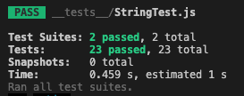

# :computer: [FE] JonghyunLEE12

###  

### :white_check_mark: 구현 로직 순서

- [x] ##### 경주할 자동차 이름 입력 받기.

  - [x] ##### 입력값(이름) 유효성 검사 진행.

- [x] ##### 시도할 횟수 입력 받기.

  - [x] ##### 입력값(횟수) 유효성 검사 진행.

- [x] ##### 시도할 횟수를 기준으로 각 차수별 실행 결과 출력

  - [x] ##### 0 - 9 무작위 값 범위 확인.

  - [x] ##### 자동차 전진 출력하기

  - [x] ##### 단독 우승 또는 공동 우승 확인

- [x] ##### 우승자 출력


#### 커밋 컨벤션

```
feat (feature)
fix (bug fix)
docs (documentation)
style (formatting, missing semi colons, …)
refactor
test (when adding missing tests)
chore (maintain)
```


### :warning: 기능 구현 중 이슈

----


#### 커밋메세지 영어에서 한글로 변경

우테코 프리코스 미션 중 `커밋 메시지를 의미 있게 작성한다` 라는 피드백이 있어,
해당 커밋에 작업한 내용에 대한 이해가 되도록 영어에서 한글로 작성하게 되었습니다.


#### :wrench: 첫번째 리팩토링

MVC 패턴을 기반으로 하던 중  `의존성원칙` 에 대한 중요성을 알게 되었습니다.

1. Model은 View 와 Controller의 의존하면 안된다.
2. View는 사용자에게 데이터를 보여주는 역할
3. Controller는 중개자로, Model 과 View 모두 의존 가능


> ##### `의존성원칙` 을 생각하며 코드 리팩토링 하였습니다.


#### :wrench:두번째 리팩토링

기존의 코드에선 

```js
const CONSTANTS = {
    vehicleNameList : [],
    gamePlayTimes : 0,
    vehicleNameObject : {},
    moveProcedure : {},
    champion : [],
}
```

와 같이 CONSTANTS 객체를 선언 뒤, Controller 나 View 등에서 사용하였다.
하지만 외부에서 쉽게 변경 가능하다는 점과, 상수는 재할당이 이뤄지면 안되는데,
재할당이 이뤄지고 있었다.

그래서 이번 리팩토링을 통해, const CONSTANTS = { } 객체 대신

```js
class UpdateConstants {
    #vehicleNameList
    #gamePlayTimes
    #vehicleNameObject
    #moveProcedure
    
    constructor() {
        this.VALIDATE = new Validate();
        this.#vehicleNameList =  [];
        this.#gamePlayTimes = 0;
        this.#vehicleNameObject = {};
        this.#moveProcedure = {};
    }
}
```

> ##### Models/에 private fields 로 변수를 선언 후 관리하는 방식으로 리팩토링 하였다.


### :file_folder: 폴더구조

------


```
└── src
    ├── App.js
    ├── constants
    │   ├── Constants.js
    │   └── OutputMsg.js
    ├── controller
    │   ├── Controller.js
    │   └── GameStart.js
    ├── index.js
    ├── models
    │   └── UpdateConstant.js
    ├── utils
    │   └── Validate.js
    └── views
        └── OutputView.js
```


#### index & App

- 프로그램 실행

#### GameStart

- 프로그램 전제 로직 제어
- View와 상호작용

#### Controller

- 사용자 입력 받기
- model 과의 상호작용
- 우승자 확인

#### UpdateConstant

- 프로그램에 사용되는 객체 상태변화 관리
  - 경주할 자동차 정보
  - 시도 횟수
  - 자동차 전진-정지 과정

#### OutputView

- 메세지 와 자동차 전진-정지 과정을 출력

#### Validate

- 입력값에 대한 유효성 검사
- Random 숫자가 4이상인지 확인

### Constants

- 프로그램에 필요한 상수관리
  - `이름은 5자 이하만 가능하다.`
  - `전진하는 조건은 0에서 9 사이에서 무작위 값을 구한 후 무작위 값이 4 이상`
  - `전진 : -` `정지 : `

#### OutputMsg

- 프로그램에 필요한 메세지 관리


### :rocket: 실행 결과

---


