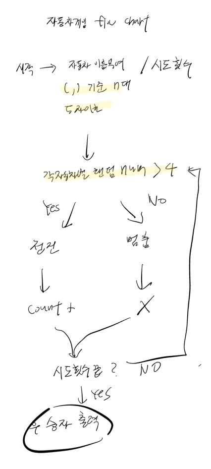

# 기능 구현 목록

## 플로우 차트

### 유저는 자동차의 이름을 n대 만큼 입력할 수 있다.

- 여러대의 자동차 입력은 (,) 로 구분한다
- 각각 5자 이하여야 한다.

### 유저는 경주를 시도할 횟수를 입력할 수 있다.

- 정수만 입력할 수 있다

### 유저는 자동차의 각 차수별 실행 결과를 볼 수 있다.

- 각 자동차는 제각각의 랜덤 수를 차수별로 가지고있다.

- 각 자동차의 랜덤 수가 4 이상이면 전진하여 카운트가 증가되고 이하면 카운트는 변화하지 않는다.

- 카운트가 존재한다면 카운트만큼의 (-)를 자동차 이름과 함께 표시한다.

### 유저는 게임이 끝나면 결과를 볼 수 있다.

- 카운트가 가장 많은 자동차가 결과에 출력된다.

- 여러대일 경우 (,)를 이용하여 구분한다

### 유저는 잘못된 값을 입력하면 에러메세지로 힌트를 받을수 있다

/공통: 게임은 종료된다.

- 정수가 아닌 값 입력시
- 5자 이하일시
- 숫자가 아닌 값 입력시
- 입력을 안 했을 시
- 중복된 값을 입력했을시

### 추가 요구사항

1. Jest를 이용하여 본인이 정리한 기능 목록이 정상 동작함을 테스트 코드로 확인한다.

2. indent(인덴트, 들여쓰기) depth를 3이 넘지 않도록 구현한다. 2까지만 허용한다.

ex) for/ while 문 안에 if 있으면 딱 인덴트 2

### 라이브러리

사용자의 값을 입력 받고 출력하기 위해서는 Console.readLineAsync, Console.print를 활용한다.
