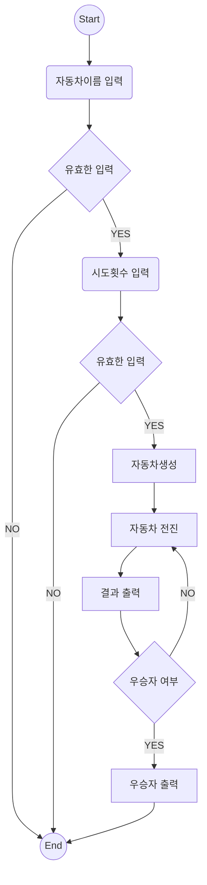
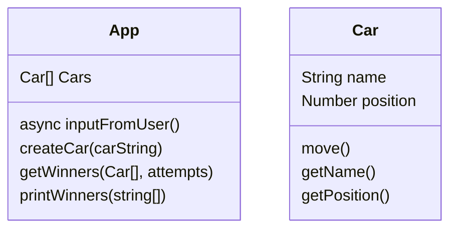

# 미션 - 자동차 경주

## 이번 주 목표

- 결과 최대한 추상화
- 더 다양한 상황 예측
- 고민 공유
- 2주 차 미션에서는 1주 차에서 학습한 것에 더해 **함수를 분리**하고, 각 **함수별로 테스트를 작성하는 것**에 익숙해지는 것을 목표로 하고 있어요. (우테코 이메일)
- 공통 피드백 지키기

## 설계

### 플로우 차트

### 구현 기능

- 입력
  - 자동차이름 입력
  - 시도횟수 입력
- 유효성
  - 자동차 이름 유효성 검사
    - 자동차 이름은 쉼표(,)를 기준으로 구분하며 이름은 5자 이하
  - 시도 횟수
    - 숫자
- 출력
  - 자동차 이동 결과 출력
  - 우승자 출력
- 경주
  - 입력한 개수만큼 자동차 생성
  - 우승자가 나올 때 까지 자동차 이동
    - 자동차 이동 기능
    - 우승자 여부 판단 기능

### Class Diagram

