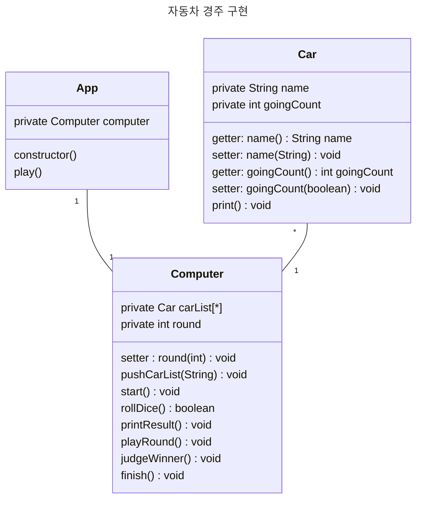

# ⭕️ 자동차 경주 :: 기능 구현 명세서

## 💡 0. 목차
1. 개요
2. 시나리오를 텍스트로 정리
3. UML을 통한 객체 지향적 설계
4. 구현할 기능 목록

 

## 💡 1. 개요
### 🎯 우아한테크코스 2 주차 과제 :: 자동차 경주

- 기능 구현에 앞서서 요구사항을 분석하고, 이를 바탕으로 구현할 기능 목록을 정의하고자 한다.   
- 이번 시간에는 지난 주차 과제와는 다르게 객체지향적인 설계를 바탕으로, 자바스크립트에서 클래스를 사용해서 구현하고자 한다.   
- 시나리오는 사용자가 게임을 플레이할 때, 어떻게 진행될 지에 대해 서술하며, 이를 바탕으로 UML을 활용해 객체지향적 설계를 한다.   
- UML을 통한 객체지향적 설계를 활용해서, 클래스와 객체를 단위로 하여 구현할 기능을 파악하여 목록을 정리한다.

  

## 💡 2. 시나리오를 텍스트로 정리

### 🎯 사용자 측면에서 시나리오 분석

#### 🛣️ 프로그램 시작시
- 사용자는 쉼표(,)를 기준으로 구분하여 각각 5자 이하의 이름을 가진 n대의 자동차 이름을 입력한다.
- 사용자는 시도할 횟수를 입력한다.
- 정상적인 값이 입력되면 게임은 그대로 진행이 되고, 잘못된 값을 입력한 경우 throw문을 바탕으로 "[ERROR]" 로 시작하는 메세지를 가지는 예외가 발생하며, 애플리케이션은 종료된다.

#### 🛣️ 사용자 입력 이후 프로그램 동작
- 사용자가 입력하고 나면, 각각의 자동차 이름에 맞는 객체를 생성한다.
- 사용자가 반복할 값이 입력될 경우 다음과 같은 동작을 횟수만큼 반복한다.
    - 각 객체 별로 0에서 9 사이의 무작위 숫자를 생성하고, 이를 비교해서 4 이상일 경우 거리를 + 1 한다.
- "실행 결과" 문자열을 출력한다.
- 각각의 과정에 대해, 객체들이 가진 거리 값을 -를 이용해서 출력한다.
- 1회차가 끝나면 줄바꿈을 하고, 다시 반복한다.

  

- 간략하게 사용자 흐름을 글로 적으면 위와 같다.

 

## 💡 3. UML을 통한 객체 지향적 설계

 

 

## 💡 4. 구현할 기능 목록

- 3번 항목에 기반하여 구현할 기능 목록은 아래와 같다.

### 🎯 Car Class

    name은 자동차의 이름, goingCount는 움직여야하는 횟수이다.
- [x] (getter) name : 자동차의 이름(name)을 반환한다.
- [x] (setter) name : 사용자가 입력한 이름이 1자 이상 5자 이하인지 검증하고, 맞을 시 이름을 설정하고, 아닐 시 "[ERROR] 1자 이상 5자 이하의 문자가 입력되지 않음."이라는 예외를 발생시킨다.
- [x] (getter) count : 움직여야하는 횟수(goingCount)를 반환한다.
- [x] (setter) count : boolean으로 들어온 값이 true이면 goingCount를 1 증가시키고, false면 아무런 동작도 하지 않는다.
- [x] print : "<자동차이름> : <goingCount만큼의 ->" 를 출력한다.

### 🎯 Computer Class

    carList는 경기에 등록된 모든 자동차 리스트이고, round는 시도할 횟수이다.
- [x] (setter) round : 시도할 횟수(round)를 설정한다. 이때, 입력하는 수가 0보다 큰 정수가 아니면 "[ERROR] 숫자가 잘못된 형식입니다."는 예외를 발생시킨다.
- [ ] pushCarList : 사용자의 입력을 받아서 쉼표를 바탕으로 분류한 뒤, 이를 순서대로 자동차 객체 생성하고, 이름을 할당한 뒤 자동차 리스트(carList)에 할당한다.
- [ ] start : 게임의 시작 부분으로, 경주할 자동차와 시도할 횟수를 입력받아 내부에서 setRound, setCarList를 실행시킨다.
- [ ] rollDice : 0에서 9 사이에서 무작위 값을 구한다. 이때, 무작위 값이 4 이상일 경우 true를 리턴하고, 아니면 false를 리턴한다.
- [ ] printResult : 호출되는 시점까지의 자동차들의 이동 거리를 출력한다.이는 자동차 각각의 print() 를 실행시킨 것과 같다.
- [ ] playRound : 자동차 각각에 대해 rollDice()를 수행하고, 그 결과를 자동차 각각의 setCount를 호출해 전달한다. 그리고 모든 객체에 대해 순회가 끝나면 printResult를 출력한다.
- [ ] judgeWinner : 최종 우승자를 판별해 출력한다.
- [ ] finish : "실행 결과" 를 출력하고, playRounds(), judgeWinner()를 실행한다.

### 🎯 App Class

    computer는 컴퓨터 객체로 단 하나의 객체만을 갖는다.
- [ ] constructor : 새로운 Computer 객체를 생성해 computer에 할당한다.
- [ ] play : computer.start(), computer.finish()를 실행한다.