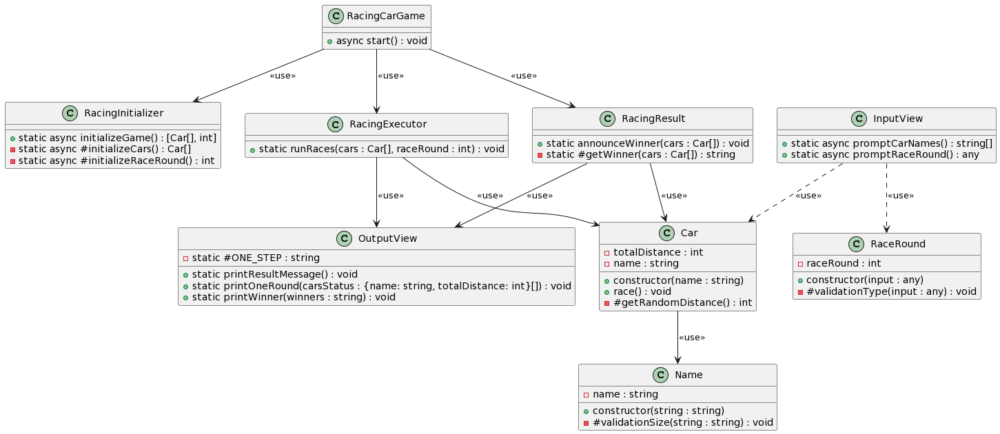

## 🗒️ README 목차

- [🗒️ README 목차](#️-readme-목차)
- [✅ 구현 기능 목록](#-구현-기능-목록)
- [🎨 클래스 다이어그램](#-클래스-다이어그램)
- [✨ 1주차 미션보다 개선된 점](#-1주차-미션보다-개선된-점)

 
 

## ✅ 구현 기능 목록

<h3>- Models</h3>
<table>
  <tr>
    <th>클래스</th>
    <th>기능 및 상태</th>
  </tr>
  <tr>
    <td>Car</td>
    <td>
    </>
      <li><code>Random.pickNumberInRange()</code>를 사용하여 무작위 값 추출.</li>
      <li>속성: 이름(Name), 총 이동거리(Total Distance)</li>
      <input type="checkbox" checked disabled> - 0에서 9 사이 무작위 값 추출 (이동거리로 사용). 
      <input type="checkbox" checked disabled> 값이 4 이상일 경우 전진 (총 이동거리 + 이동거리). 
      <input type="checkbox" checked disabled> 값이 3 이하일 경우 멈춤 (총 이동거리 + 0). 
      <!-- <input type="checkbox" checked disabled> 자동차의 이름과 총 이동거리를 객체로 얻을 수 있음.
        -->
    </td>
  </tr>
  <tr>
    <td style="padding-left:20px">Name</td>
    <td style="padding:10px;">
      <input type="checkbox" checked disabled> 이름이 공백이 아니고 5자 이하인지 검증. 
      <input type="checkbox" checked disabled> 이름 앞뒤에 공백이 있을 경우 공백 제거(trim).
    </td>
  </tr>
  <tr>
    <td style="padding-left:20px">RaceRound</td>
    <td style="padding:10px;">
      <input type="checkbox" checked disabled> 입력된 문자열이 숫자인지 검증하고 숫자로 변환.
    </td>
  </tr>
</table>
 
<h3>- Controller</h3>
<table>
  <tr>
    <th>클래스</th>
    <th>기능 및 상태</th>
  </tr>
  <tr>
    <td> RacingCarGame 
     RacingInitializer 
     RacingExecutor 
     RacingResult 
    </td>
    <td>
      <li> 속성: 시도 횟수, 자동차들(Cars - Car 인스턴스의 배열)</li>
      <li> 경주할 자동차 이름 입력 받아 Car 인스턴스 생성.</li>
      - 시도할 횟수도 함께 입력 받음. 
      - 게임 시작 시 각 자동차가 자신의 이동거리 계산. 
      - 각 라운드 결과를 OutputView에 전달하여 출력. 
      - 위 과정을 시도 횟수만큼 반복. 
      - 모든 자동차의 총 이동거리를 받아 가장 먼 거리의 자동차 이름 발표. 
      - 동점일 경우 이름을 쉼표와 공백으로 구분하여 모두 출력.
    </td>
  </tr>
</table>
 
<h3>- Views</h3>
<table>
  <tr>
    <th>클래스</th>
    <th>기능 및 상태</th>
  </tr>
  <tr>
    <td>InputView</td>
    <td>
      <li><code>Console.readLineAsync</code> 사용하여 입력 받음.</li>
      <input type="checkbox" checked disabled> 자동차 이름을 쉼표로 구분하여 입력 받음. 
      <input type="checkbox" checked disabled> 경주 시도 횟수 입력 받음.
    </td>
  </tr>
  <tr>
    <td>OutputView</td>
    <td>
      <li><code>Console.print</code>를 사용하여 출력.</li>
      <input type="checkbox" checked disabled> '실행 결과'를 출력. 
      <input type="checkbox" checked disabled> 각 자동차의 이름과 라운드별 총 이동거리를 입력 받아 출력. 
      <input type="checkbox" checked disabled> 최종 우승자(들)를 발표.
    </td>
  </tr>
</table>

 

## 🎨 클래스 다이어그램

<!--  -->

## ✨ 1주차 미션보다 개선된 점
