# 📚 WOOWAPRECOURCE ASSIGNMENT

# 🚗 자동차 경주

## 📜 기능 요구사항

### 게임 시작 시 사용자 입력 기능
- 게임 진행을 위해 경주 할 자동차 이름을 입력받아야 한다.
- 자동차 이름은 공백없는 쉼표 기준으로 구분되어야 하고, 5자 미만이어야 한다. 조건에 부합하지 않는다면 예외처리 한다.
- 시도할 횟수를 입력받아야 한다.
- 시도할 횟수는 숫자만 입력해야한다. 조건에 부합하지 않는다면 예외처리 한다.

### 0부터 9사이의 무작위 값을 뽑는 기능
- `MissionUtils.Random.pickNumberInRange`를 통해 무작위로 0부터 9사이의 값들 중에서 값을 뽑는다.

### 자동차를 움직이는 기능
- 무작위로 생성한 값이 5 이상이라면 해당 자동차를 한 칸 이동시킨다.
- 차가 한대라도 움직이지 않았어도 1회 움직임으로 취급한다.

### 움직임 결과 출력 기능
- 한 턴의 움직임이 끝났을 때(모든 플레이어의 움직임 여부가 정해졌을 때) 결과를 출력한다.

### 최종 결과 출력 기능
- 가장 많이 이동한 자동차(우승자)의 이름을 출력한다. 이 때, 우승자는 여러명일 수 있다.
- 우승자가 여러명일 경우 쉼표(,)를 사용하여 구분한다.

### 예외 처리

- 사용자가 잘못된 값을 입력할 경우 throw문을 사용해 예외를 발생시키고, "[ERROR]"로 시작하는 에러 메시지를 출력 후 종료한다.

## 🗃️ 클래스 다이어그램


## 🌊 플로우차트

```mermaid
graph TD;
    A[시작]-->B[레이싱카 이름 입력]
    B--유효X-->C[예외처리]
    B--유효O-->D[시행 횟수 입력]
    D--유효X-->E[예외처리]
    D--유효O-->F[레이스카 랜덤 번호 생성]
    F-->G[레이스카 이동]
    G-->H[이동 결과 출력]
    H--잔여시행횟수O-->F
    H--잔여시행횟수X-->I[우승자 계산]
    I-->J[우승자 출력]
```



## 🗂️ 폴더 구조

```
javascript-racingcar-6
├─ .eslintrc.cjs
├─ .gitignore
├─ .npmrc
├─ .prettierrc
├─ package.json
├─ README.md
├─ 📂 src
│  ├─ App.js
│  ├─ 📂 constants
│  │  ├─ GrandPrixError.js
│  │  ├─ GrandPrixMessage.js
│  │  ├─ GrandPrixOption.js
│  │  └─ Symbols.js
│  ├─ 📂 controller
│  │  └─ GrandPrix.js
│  ├─ 📂 docs
│  │  └─ README.md
│  ├─ 📂 error
│  │  ├─ DefaultError.js
│  │  └─ ValidationError.js
│  ├─ index.js
│  ├─ 📂 service
│  │  └─ RacingCarService.js
│  ├─ 📂 model
│  │  └─ RandomNumberGenerator.js
│  ├─ 📂 validator
│  │  ├─ CommonValidator.js
│  │  ├─ index.js
│  │  ├─ LapNumberValidator.js
│  │  └─ RacingCarNameValidator.js
│  └─ 📂 view
│     ├─ index.js
│     ├─ InputView.js
│     └─ OutputView.js
└─ 📂 __tests__
   ├─ ApplicationTest.js
   ├─ 📂 error
   │  └─ ValidationErrorTest.js
   ├─ 📂 service
   │  └─ RacingCarServiceTest.js
   ├─ 📂 model
   │  └─ RacingCarTest.js
   ├─ StringTest.js
   └─ 📂 validator
      ├─ CommonValidatorTest.js
      ├─ LapNumberValidatorTest.js
      └─ RacingCarNameValidatorTest.js

```
